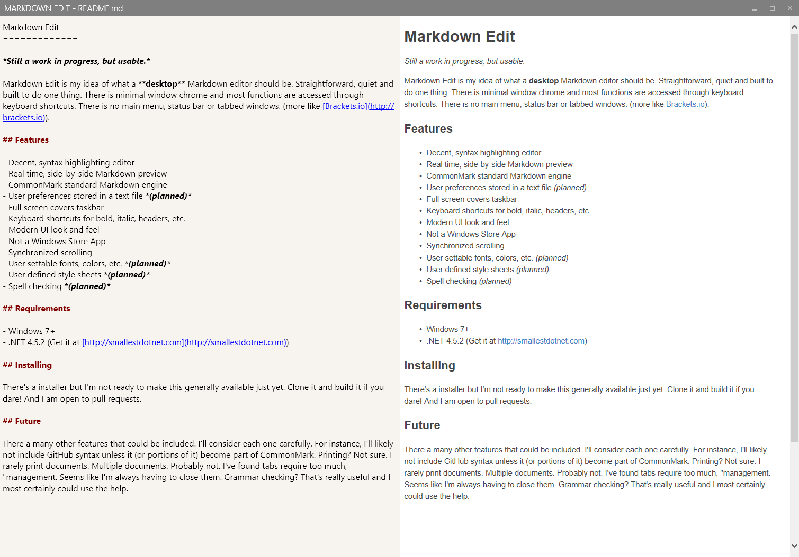

Markdown Edit
=============

*Still a work in progress, but usable.*

Markdown Edit is  a Windows **desktop** Markdown editor with an emphasis on content and keyboard shortcuts. There is minimal window chrome and most functions are accessed through keyboard shortcuts. There is no main menu, status bar, tabbed windows or other distractions..

Gratuitous Screen Shot

## Features

- Decent, syntax highlighting editor
- Real time, side-by-side Markdown preview
- CommonMark standard Markdown engine
- User preferences stored in a text file
- Full screen covers taskbar
- Keyboard shortcuts for bold, italic, headers, etc.
- Modern UI look and feel
- Not a Windows Store App
- Synchronized scrolling
- User settable fonts, colors, etc.
- User defined style sheets
- Spell checking *(planned)*

## Requirements

- Windows 7+
- .NET 4.5.2 (Get it at [http://smallestdotnet.com](http://smallestdotnet.com))

## Installing

There's an installer but I'm not ready to make it generally available just yet. Clone it and build it if you dare! I am open to pull requests.

## Future

There a many other features that could be included. I'll consider each one carefully. 

- For instance, I'll likely not include GitHub syntax unless it (or portions of it) become part of CommonMark. 
- Printing? Not sure. I rarely print documents. 
- Multiple documents? Probably not. I've found tabs require too much, "management". Seems like I'm always having to close them. 
- Grammar checking? That's useful (If I can find a free engine that is).
